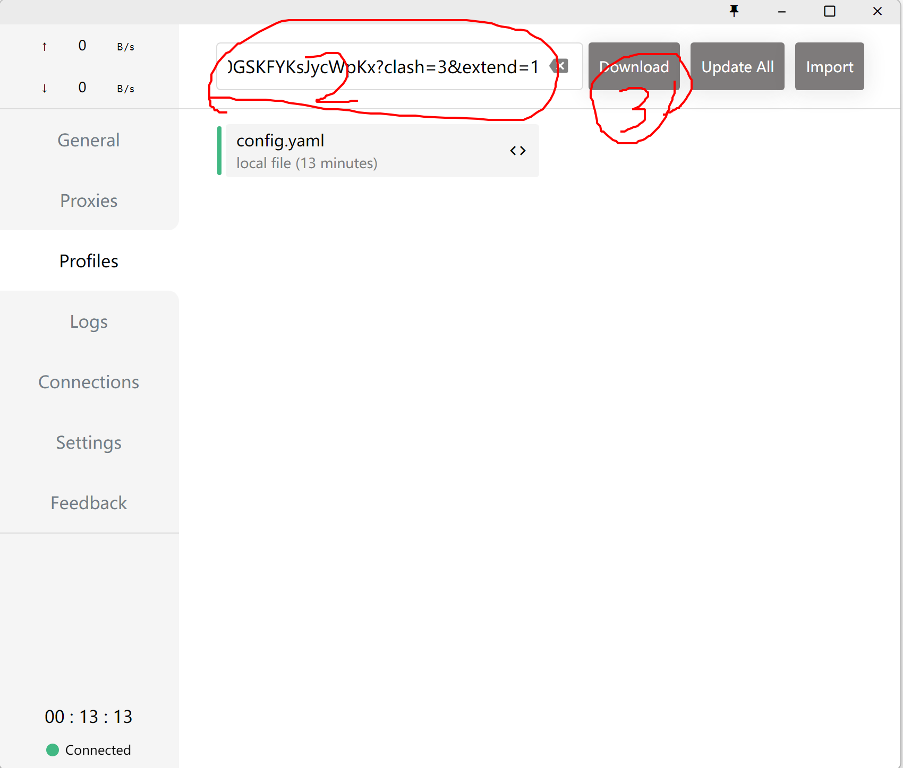
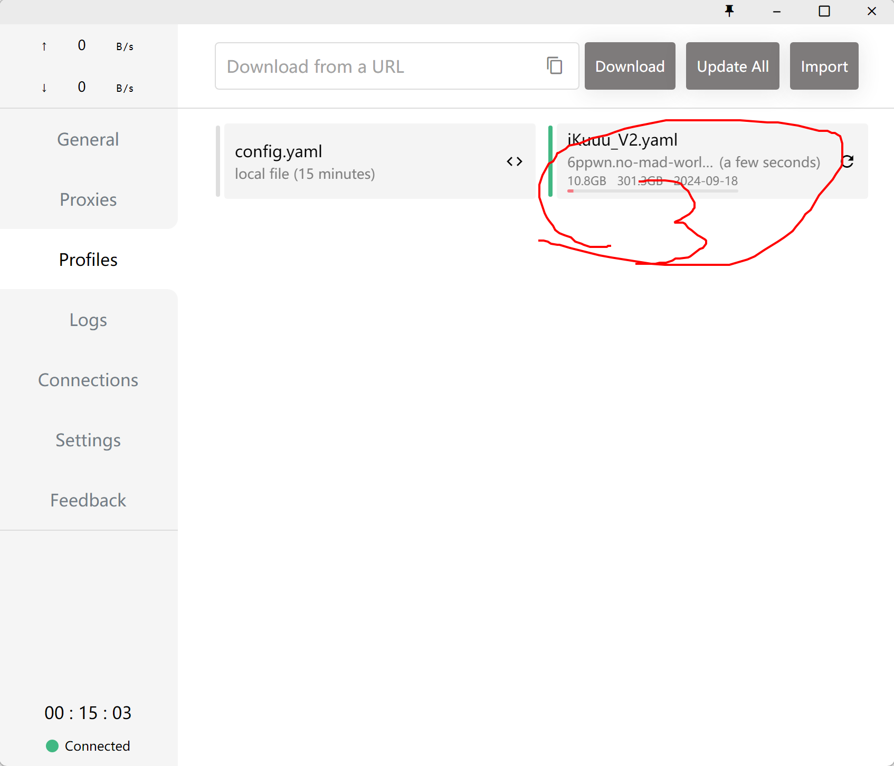
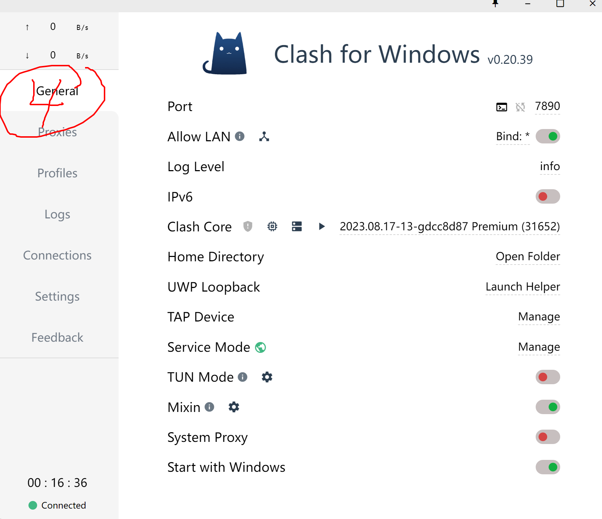
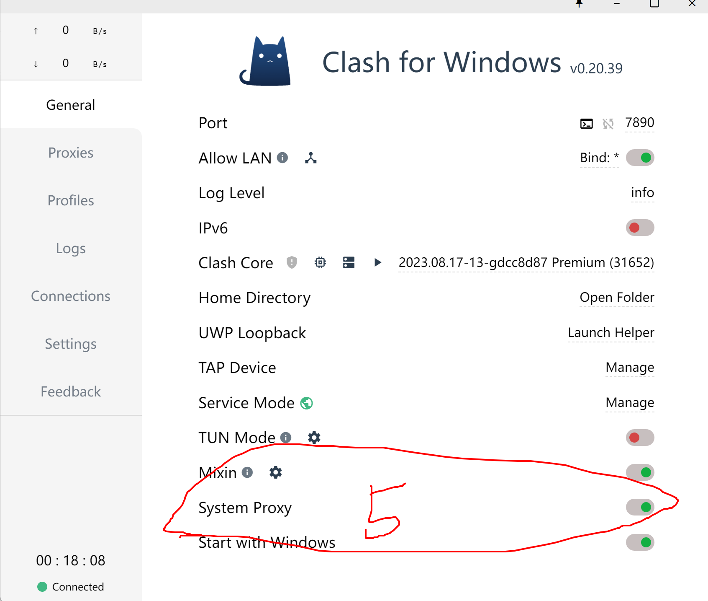
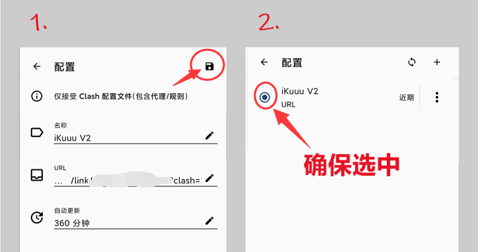
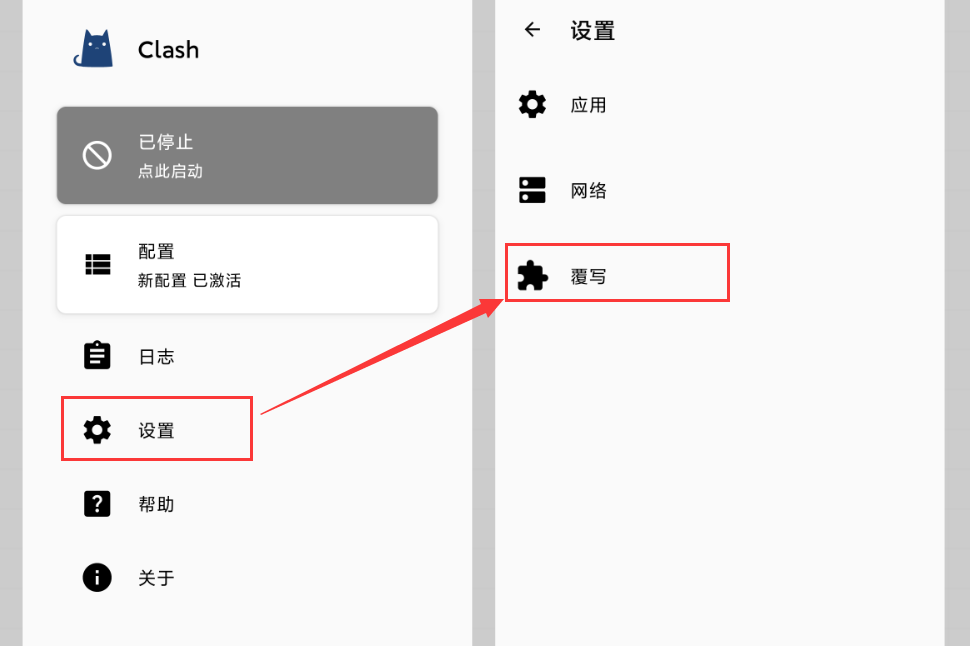
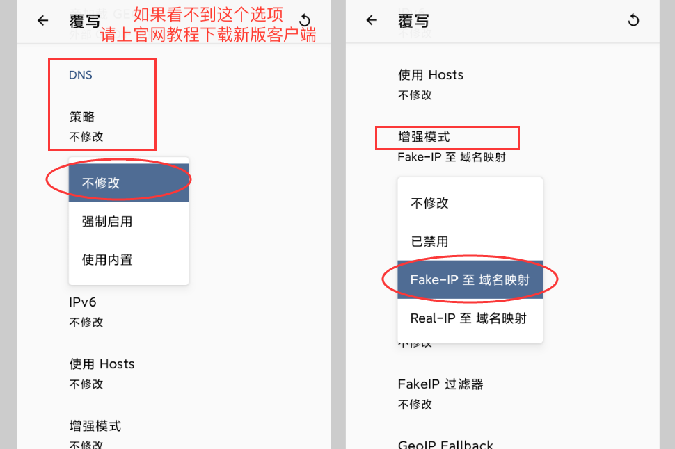
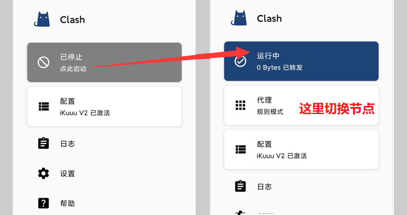

# 本教程记录clash各平台的使用方法

clash一般指的是给clash-core套上GUI客户端的一系列软件,有许多版本,功能大同小异.,只要就是用来实现科学上网.其支持全平台,这里只记录windows和Android下的使用方法.软件来源:[windows软件源网址](https://archive.org/download/clash_for_windows_pkg)

如果下面的软件下载链接你都没法成功下载,可以用我已经下载到百度网盘里面的:

Windows:

通过百度网盘分享的文件：clashwindows
链接：https://pan.baidu.com/s/1gKwwrjB7Xi1worYjcbnaAQ
提取码：lc84
--来自百度网盘超级会员V6的分享

android:

通过百度网盘分享的文件：clashAndroid
链接：https://pan.baidu.com/s/1SYp8onETc5M8Y1J-49-eHA
提取码：uyt8
--来自百度网盘超级会员V6的分享

## windows

1. 下载软件.在[软件源网址](https://archive.org/download/clash_for_windows_pkg)中选择合适自己电脑架构的软件,大多数的电脑是属于x86架构64位系统,选择:[Clash.for.Windows.Setup.0.20.39.exe](https://archive.org/download/clash_for_windows_pkg/Clash.for.Windows.Setup.0.20.39.exe)即可
2. 软件安装完成后打开软件,依次下列顺序:
   * 配置
   * 在上面的"输入URL下载配置文件"框输入:**https://6ppwn.no-mad-world.club/link/h0GSKFYKsJycWpKx?clash=3&extend=1**
   * 下载,点击一下刚下载好的yaml文件,这里应该是叫iKuuu_V2.yaml
   * 常规
   * 开启系统代理

图如下:

即可实现上网了

## 2. Andorid

安卓手机的思路是一致的.

* 下载[手机软件下载](https://lw0xw.big-files.make-w0rld-static.club:8000/file/ikuuu-static-release/cfa-iku/cfa-iku-1.0.0/clash-for-android.apk)
* 点击 配置，点击 + 新配置，选择 URL,然后输入:https://ww027.no-mad-world.club/link/h0GSKFYKsJycWpKx?clash=4&extend=1

然后做一些稳定性上的设置:

1）打开 Clash App
2）选择【设置】
3）选择【覆写】
4）DNS - 策略 -【不修改】
5）DNS - 增强模式 -【Fake-IP 至域名映射】

设置完成后就可以上网啦~~ 回到主界面，点击顶部灰色卡片，卡片颜色变成蓝色即代表代理已开启。

