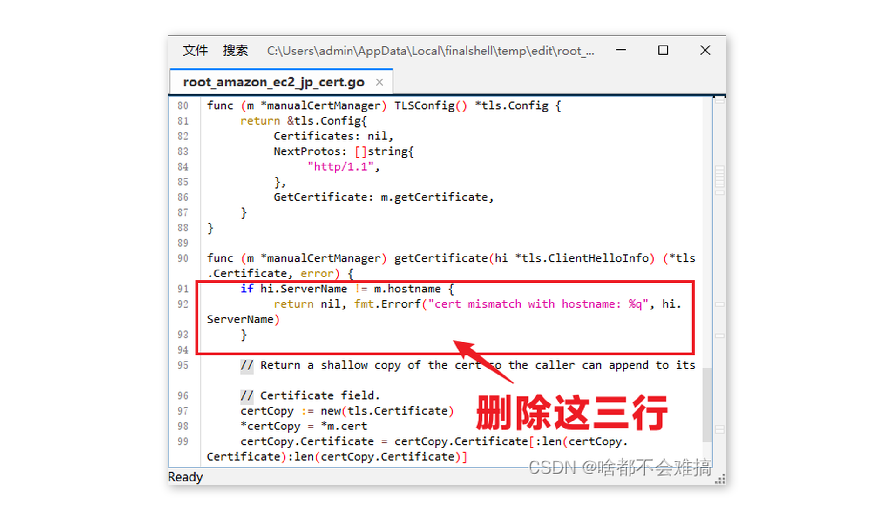

# tailscale使用教程

单用zerotier可能会出现各种问题,现在遇到的是它可能和remote-ssh有冲突.tailiscale作为备用,它在南京打洞成功的概率很低,基本都是在中转的情况(zerotier直连也快不到哪里去...),tailiscale连接成功率更高更稳定.

## 1.加入网络

带图形界面的系统基本都是下载软件->加入网络->浏览器登录->加入网络,然后一般取消密码授权的时间

linux在安装软件之后就

```
shell
tailscale up
```

同样浏览器设置即可

## 2.中转服务器的搭建

官方的中转搭建方法需要域名,所以需要重新编译中转服务器上的tailiscale

1. 安装需要的软件

   ```
   sudo apt install curl  git openssl wget -y
   ```

   安装go(注意地址要最新)

   ```
   wget https://go.dev/dl/go1.21.5.linux-amd64.tar.gz 
   ```

   ```
   rm -rf /usr/local/go && tar -C /usr/local -xzf go1.21.5.linux-amd64.tar.gz

   ```

   ```
   # check go
   eport PATH=$PATH:/usr/local/go/bin
   go version
   ```

   ```
   echo "export PATH=$PATH:/usr/local/go/bin" >> /etc/profile
   source /etc/profile
   ```

   加速go

   ```
   go env -w GO111MODULE=on
   go env -w GOPROXY=https://goproxy.cn,direct
   ```
2. 安装derp

   ```
   go install tailscale.com/cmd/derper@main

   ```

   移动到:(xxxx是乱码),打开cert.go,删除91~94行花括号内容

   ```
   cd /root/go/pkg/mod/tailscalexxxxx/cmd/derper
   vim cert.go
   ```

   编译derp(注意要在cern.go目录下),后面的地址可以自己改,但是要注意后面的步骤

   ```
   go build -o /etc/derp/derper
   ```

   创建自己的域名(CN=...是域名,无所谓.这里出现的/etc/derp估计要和前面的对应)

   ```
   openssl req -x509 -newkey rsa:4096 -sha256 -days 3650 -nodes -keyout /etc/derp/derp.myself.com.key -out /etc/derp/derp.myself.com.crt -subj "/CN=derp.myself.com" -addext "subjectAltName=DNS:derp.myself.com"
   ```

   开启服务(注意路径和前面一致开端口,33445,33446,3478)

   ```
   cat > /etc/systemd/system/derp.service <<EOF
   [Unit]
   Description=TS Derper
   After=network.target
   Wants=network.target
   [Service]
   User=root
   Restart=always
   ExecStart=/etc/derp/derper -hostname derp.myself.com -a :33445 -http-port 33446 -certmode manual -certdir /etc/derp
   RestartPreventExitStatus=1
   [Install]
   WantedBy=multi-user.target
   EOF
   ```

   ```
   systemctl enable derp
   systemctl start derp
   ```

   然后云服务器的IP地址+端口号（“自己改的端口”)就可以查看是否成功了

3. 配置
进入tailscale网页端,进入ACL界面,第七行插入:

```
  
	"derpMap": {
		"OmitDefaultRegions": true,// 禁用官方中转
		"Regions": {
			"901": {
				"RegionID":   901,
				"RegionCode": "Myself",
				"RegionName": "Myself Derper",
				"Nodes": [
					{
						"Name":             "901a",
						"RegionID":         901,
						"DERPPort":         33445,
						"IPv4":            "服务器IP",
						"InsecureForTests": true,
					},
				],
			},
		},
	},
```

可以加入官方香港ipv6的支持

```
  
	"derpMap": {
		//"OmitDefaultRegions": true,// 禁用官方中转
		"Regions": {
			"901": {
				"RegionID":   901,
				"RegionCode": "Myself",
				"RegionName": "Myself Derper",
				"Nodes": [
					{
						"Name":             "901a",
						"RegionID":         901,
						"DERPPort":         33445,
						"IPv4":            "服务器IP",
						"InsecureForTests": true,
					},
				],
			},
            "1":  null,
            "2":  null,
            "3":  null,
            "4":  null,
            "5":  null,
            "6":  null,
            "7":  null,
            "8":  null,
            "9":  null,
            "10": null,
            "11": null,
            "12": null,
            "13": null,
            "14": null,
            "15": null,
            "16": null,
            "17": null,
            "18": null,
            "19": null,
            //"20": null,
            "21": null,
            "22": null,
            "23": null,
            "24": null, 
            "25": null,
		},
	},

```

有ipv6就直接在''ipv4"下面添加,不需要用官方

## 3.协调服务器

下载

```
wget --output-document=headscale.deb
    https://github.com/juanfont/headscale/releases/download/v0.22.3/headscale_0.22.3_linux_amd64.deb
```

安装

```
sudo dpkg --install headscale.deb
```

自启

```
sudo systemctl enable headscale
```

编辑(公网和自定义端口)

```
vim /etc/headscale/config.yaml
```

```
server_url: http://113.31.108.105:3355
```

注释ipv6

```
ip_prefixes:
  # - fd7a:115c:a1e0::/48
  - 100.64.0.0/10

```

安装网页服务器

```
apt install -y nginx
```

18行编辑加入

```
vim /etc/nginx/sites-available/default

```

```
map $http_upgrade $connection_upgrade {
    default      keep-alive;
    'websocket'  upgrade;
    ''           close;
}
server {
    listen 3355;# 端口
    listen [::]:3355;#端口
    server_name 云服务器IP; #ip
    location / {
   
        proxy_pass http://127.0.0.1:8080;
            proxy_http_version 1.1;
        proxy_set_header Upgrade $http_upgrade;
            proxy_set_header Connection $connection_upgrade;
            proxy_set_header Host $server_name;
            proxy_buffering off;
            proxy_set_header X-Real-IP $remote_addr;
            proxy_set_header X-Forwarded-For $proxy_add_x_forwarded_for;
            proxy_set_header X-Forwarded-Proto $http_x_forwarded_proto;
            add_header Strict-Transport-Security "max-age=15552000; includeSubDomains" always;
 
    }
   
    location /web {
        index  index.html;
            alias  /var/www/web;
    }
}
```

下载ui

```
wget https://github.com/gurucomputing/headscale-ui/releases/download/2023.01.30-beta-1/headscale-ui.zip
```
```
systemctl start headscale
 
systemctl restart nginx
```
生成密码
```
headscale apikeys create --expiration 9999d
```
复制密码,登录,密码要纪录
tailscale logout
tailscale up --login-server=http://云服务器IP:3355
输入密码
创建新用户
