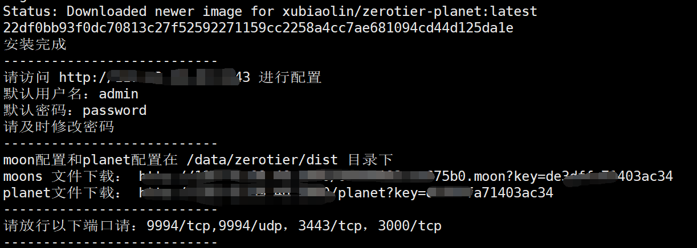
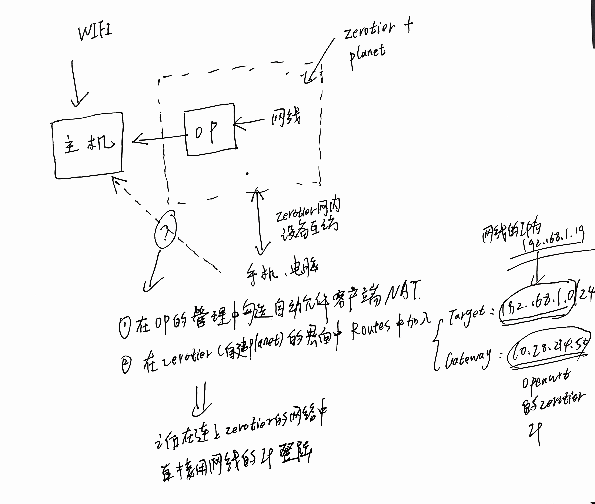

# zx 记录zerotier的配置planet以及各种细节的过程

## 1.  安装/购买op路由器

这不是我的擅长之处

---

## 2. 创建自己的planet

想要有好的体验和安全,一般都要自建plant,这步需要在有外网ip的服务器下运行.这种云服务器一般可以非常容易安装docker,那么只需要根据下面的github来就行:[docker安装]((docker-zerotier-planet/README.md at master · xubiaolin/docker-zerotier-planet (github.com))

下面是连接里面的教程 :

### 2.1：准备条件

- 具有公网 `ip` 的服务器（需要开放 3443/tcp 端口，9994/tcp 端口，9994/udp 端口）[这里的9994需要你根据实际情况替换]
- 安装 `docker`、`git`，
- Debian10+，Ubuntu20+ 等内核大于5.0的系统均支持
- CentOS不支持，内核太低了，可能需要手动升级内核

安装各种依赖:(git,docker)

git:ubuntu等:

```shell
apt update && apt install git -y
```

git:centos等:

```shell
yum update && yum install git -y
```

git:docker

```shell
curl -fsSL https://get.docker.com |bas
```

git:如果网络问题，导致无法安装，可以使用国内镜像安装：

```powershell
curl -fsSL get.docker.com -o get-docker.sh
sudo sh get-docker.sh --mirror Aliyun
```

启动docker:

```powershell
service docker start
```

### 2.2 下载项目源码

```shell
git clone https://github.com/xubiaolin/docker-zerotier-planet.git
```

国内加速:

```shell
git clone https://ghproxy.imoyuapp.win/https://github.com/xubiaolin/docker-zerotier-planet.git
```

### 2.3 安装

1. 执行脚本

   ```shell
   cd docker-zerotier-planet
   ./deploy.sh
   ```

   根据提示执行脚本,1为安装,直到出现:
2. 下载planet

   脚本运行完成后，会在 `./data/zerotier/dist` 目录下有个 `planet`和 `moon` 文件,可以直接访问安装完成后的url下载，也可以用scp等其他方式下载,我们用planet保存起来就行.

### 2.4 启用planet

从前面的图片中可以进入zerotier的配置界面,创建一个网络,选中easy setup.然后就可以在不同客户端中启用这个planet了.

1. windows

   将 `planet` 文件覆盖粘贴到 `C:\ProgramData\ZeroTier\One`中(这个目录是个隐藏目录，需要运允许查看隐藏目录才行),然后重启服务(Win+S 搜索 `服务`,找到ZeroTier One，并且重启服务),然后再输入ID加入网络即可.在管理员cmd下zerotier-cli.bat peers可以看到可以看到有一个 PLANTET 和 LEAF 角色
2. Linux

   1. 安装linux客户端软件
   2. 进入目录 `/var/lib/zerotier-one`
   3. 替换目录下的 `planet` 文件
   4. 重启 `zerotier-one` 服务(`service zerotier-one restart`)
   5. 加入网络 `zerotier-cli join` 网络 `id`
   6. 管理后台同意加入请求
   7. `zerotier-cli peers` 可以看到 ` planet` 角色
3. 安卓
   使用第三方安卓[Zerotier 非官方安卓客户端
   ](https://github.com/kaaass/ZerotierFix)
4. mac
   进入官网下载dmg: [https://www.zerotier.com/download/](https://www.zerotier.com/download/) 同上替换文件路径:/Library/Application\ Support/ZeroTier/One/

---

## 3. 不同设备加入zerotier



设置方法如上图所示,主要是(这里假设用的网线连接op,无线不连接op,有线网ip为:192.168.1.19,openwrt的zerotier的ip为10.28.234.50):

* 在openwrt的zerotier插件管理中勾选 **自动允许客户端ANT**
* 在zerotier的管理界面(自建planet/zerotier官网界面,也就是勾选允许加入局域网的页面),**在rount中添加一个路由:target设置为:192.168.1.0/24(因为网线的ip为192.168.1.x)**
* ***gateway网关设置为:10.28.234.50(openwrt的zerotier的ip)***

之后就可以在开启zerotier局域网的情况下直接使用有线网的ip访问了,而不需要安装新的zeriotier

---

## 4. 配置文件的持久化

参考文献:[openwrt持久化](https://blog.mewwoof.cn/tech/cloud-native/1897/)

**为什么需要持久化配置?** 搞了个glinet的路由器,自带的zerotier是不知道是为什么,每次启动/开机都会覆盖原来的配置文件,(初始文件被默认放在/temp临时文件夹)原始的配置文件目录为/var/lib/zerotier,先把它复制到不会删除的目录,比如 /root下.

```shell
cp  /var/lib/zerotier-one /root/
```

然后在配置里面设置:

```shell
vim /etc/config/zerotier
```

```
onfig zerotier zt_glan
        # 启用开关
        option enabled 1        # 永久存储配置路径
        option config_path '/etc/zerotier'        # 将永久存储配置文件夹链接还是复制到/var/lib。我建议设置成0
        # 如果不希望zerotier频繁修改硬盘/FLASH上的文件，可以将它设置为1
        # 这里有个细节问题，根据不同需要可能配置不同。可参考2.2.5小节
        option copy_config_path '0'        # 这个是告诉zerotier-cli，本地的服务运行在哪个端口，而不是服务监听端口
        # 最好不配置，因为zerotier-cli会自动读取zerotier-one.port文件
        # 如果你想配置服务监听端口，你应该在local.conf中配置
        #option port '9993'        # 可以指定local.conf的路径
        #option local_conf '/etc/zerotier.conf'        # 留空，第一次启动服务时会自动填入
        option secret ''    # 要加入的网络id
        list join 'abcdabcd'
        # 要加入多个网络，在下面加即可
        list join 'another_network_id1'
        list join 'another_network_id2'
```

主要是要设置为1,复制模式,每次都从特定的目录上复制配置文件.

---

## 5. 通过zerotier实现vpn

已知道一个10.128.234.50可以上科学上网,要求10.128.234.212通过它来科学上网.只需要添加一个路由表:  **10.128.234.212/0 via 10.128.234.50.**

然后在10.128.234.212上开启 Route via zerotier的选择就行.如果不需要科学上网了就把这个选择取消,然后重新连接就行

---
